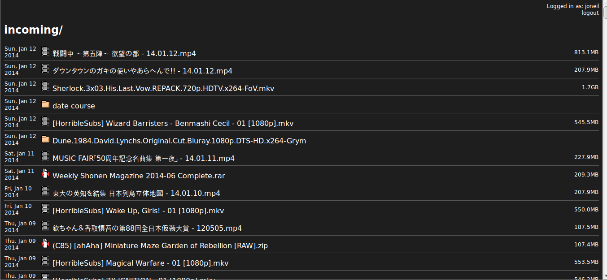

tornado_fileserv
================

Simple Tornado based fileserver. Meant as brainless (and secure) way to get a system folder on the web.

Installation
------------
To install just point pip to this git
```
pip install git+https://github.com/johnoneil/tornado_fileserv
```
Or you can clone the git and install manually
```
git clone https://github.com/johnoneil/tornado_fileserv
...
cd tornado_fileserv
python setup.py install
```

Running
-------
Installing the package give access to the 'tornado-fileserv' command line tool. Typically it's called in the form:
```
tornado-fileserv --dir='/home/user/directory_of_interest' --password='xxx'
```
The indicated directory is then accesible via a browser at (default) port 8888. An alternate port and other options can be specified via further options.
```
$ tornado-fileserv --help
Usage: /usr/local/bin/tornado-fileserv [OPTIONS]

Options:

  --chunksize                       (default 16384)
  --dir                             (default .)
  --help                           show this help information
  --log_file_max_size              max size of log files before rollover
                                   (default 100000000)
  --log_file_num_backups           number of log files to keep (default 10)
  --log_file_prefix=PATH           Path prefix for log files. Note that if you
                                   are running multiple tornado processes,
                                   log_file_prefix must be different for each
                                   of them (e.g. include the port number)
  --log_to_stderr                  Send log output to stderr (colorized if
                                   possible). By default use stderr if
                                   --log_file_prefix is not set and no other
                                   logging is configured.
  --logging=debug|info|warning|error|none 
                                   Set the Python log level. If 'none', tornado
                                   won't touch the logging configuration.
                                   (default info)
  --password                       
  --port                            (default 8888)
  --static                          (default /usr/local/lib/python2.7/dist-pack
                                   ages/tornado_fileserv-0.1-py2.7.egg/tornado_
                                   fileserv)
```
The static directory above points to the location of static assets. On second thought this option ought to be removed.

Example
-------
Running the server on localhost port 8888 (default) as follows:
```

```
Brings up the login screen at session start. If a password is defined as a command line option, the same password is required at signin. If none is specified it can be left blank.


And once signed in, simple directory contents are available. Click files to initiate download, click directories to recurse. Note unicode filenames are well handled.



